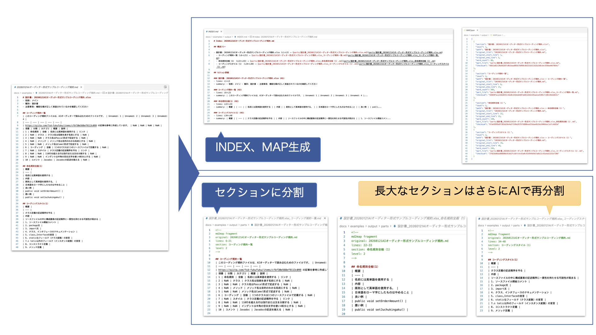

# code2map

[English](./README.md) | [日本語](./README_ja.md)

[](https://elvez.co.jp/)
[](https://elvez.co.jp/ixv/)
[](https://opensource.org/licenses/MIT)
[](https://www.python.org/)
[](https://github.com/elvezjp/code2map/stargazers)

A CLI tool that transforms large source code into "semantic maps (index + code parts)" for AI analysis and review.



## Use Cases

- **AI Code Review**: Split large files into AI-friendly units to improve review accuracy
- **Code Structure Visualization**: Output class/method lists and dependencies as an index
- **Line Number Mapping**: Reliably map AI feedback to original file line numbers
- **Documentation Assistance**: Support design document creation with code structure insights

## Background

This tool is a small utility born from the development of **IXV**, an AI development assistant focused on Japanese development documents and specifications.

IXV addresses the challenges of understanding, structuring, and utilizing Japanese documents in system development. This repository publishes a portion of that work.

## Features

- **Semantic Splitting**: Split code by class, method, and function units (for review, not build)
- **Markdown Index Generation**: Auto-generate INDEX.md with role descriptions, call relationships, and side effects
- **Line Number Mapping**: Provide correspondence between parts and original file in MAP.json (machine-readable)
- **Python & Java Support**: Accurate symbol extraction via AST analysis
- **Dry Run**: Preview generation plan before actual output

## Documentation

- [CHANGELOG.md](CHANGELOG.md) - Version history
- [CONTRIBUTING.md](CONTRIBUTING.md) - Contribution guidelines
- [SECURITY.md](SECURITY.md) - Security policy
- [spec.md](spec.md) - Technical specification
- [docs/examples/](docs/examples/) - Usage examples and sample I/O

## Setup

### Requirements

- Python 3.9 or higher
- [uv](https://docs.astral.sh/uv/) (recommended package manager)

### Installation

```bash
# Clone the repository
git clone https://github.com/elvezjp/code2map.git
cd code2map

# Install dependencies with uv (virtual environment created automatically)
uv sync --all-extras

# Verify installation
uv run code2map --help
```

## Usage

### Basic Execution

```bash
# Analyze a Python file
uv run code2map build your_code.py --out ./output

# Analyze a Java file
uv run code2map build YourCode.java --out ./output
```

### Check Output

```bash
# View the index
cat output/INDEX.md

# View the split code parts
ls output/parts/

# View the line number mapping
cat output/MAP.json
```

### Dry Run (Preview)

```bash
# Preview the plan without generating files
uv run code2map build your_code.py --dry-run
```

## Main Options

| Option | Default | Description |
|--------|---------|-------------|
| `--out <DIR>` | `./code2map-out` | Output directory |
| `--lang {java,python}` | Auto-detect | Explicitly specify language |
| `--id-prefix <PREFIX>` | `CD` | Symbol ID prefix (CD1, CD2, ...) |
| `--verbose` | false | Output detailed logs |
| `--dry-run` | false | Preview only, no file generation |

For details, see `uv run code2map build --help`.

## Output Examples

### INDEX.md

```markdown
# Index: user_management.py

## Classes
- [CD1] UserManager (L10–L150) → parts/UserManager.class.py
  - role: Main class for user management
  - calls: Database.connect, Logger.info
  - side effects: DB operations, logging

## Methods
- [CD2] UserManager#create_user (L45–L80) → parts/UserManager_create_user.py
  - role: Create a new user
  - calls: validate_email, hash_password
  - side effects: DB operations
```

### MAP.json

```json
[
  {
    "id": "CD1",
    "symbol": "UserManager",
    "type": "class",
    "original_file": "user_management.py",
    "original_start_line": 10,
    "original_end_line": 150,
    "part_file": "parts/UserManager.class.py",
    "checksum": "a1b2c3d4..."
  }
]
```

## Directory Structure

```text
code2map/
├── code2map/              # Main package
│   ├── cli.py             # CLI entry point
│   ├── generators/        # Output generation modules
│   │   ├── index_generator.py   # INDEX.md generation
│   │   ├── map_generator.py     # MAP.json generation
│   │   └── parts_generator.py   # parts/ generation
│   ├── models/            # Data models
│   │   └── symbol.py      # Symbol information class
│   ├── parsers/           # Language parsers
│   │   ├── base_parser.py     # Base class
│   │   ├── java_parser.py     # Java parser
│   │   └── python_parser.py   # Python parser
│   └── utils/             # Utilities
│       ├── file_utils.py  # File operations
│       └── logger.py      # Log configuration
├── tests/                 # Test code
│   └── fixtures/          # Test fixtures
├── docs/                  # Documentation
│   └── examples/          # Usage examples and sample I/O
├── CHANGELOG.md           # Change history
├── CONTRIBUTING.md        # Contribution guide
├── README.md              # This file (English)
├── README_ja.md           # Japanese README
├── SECURITY.md            # Security policy
├── spec.md                # Technical specification
└── pyproject.toml         # Project configuration
```

## Limitations

- **Single File Processing**: Currently processes one file at a time (batch directory processing planned)
- **Static Analysis Only**: Cannot detect dynamic dispatch or reflection
- **Supported Languages**: Python and Java only (more languages planned)

For details, see [spec.md](spec.md).

## Security

For security details, see [SECURITY.md](SECURITY.md).

- Be cautious when processing files from untrusted sources
- Output files contain the original source code

## Contributing

Contributions are welcome. For details, see [CONTRIBUTING.md](CONTRIBUTING.md).

- Bug reports & feature requests: [Issues](https://github.com/elvezjp/code2map/issues)
- Pull requests: Branch naming convention `{username}/{date}-{description}`

## Changelog

For details, see [CHANGELOG.md](CHANGELOG.md).

## License

MIT License - For details, see [LICENSE](LICENSE).

## Contact

- **Issues**: [GitHub Issues](https://github.com/elvezjp/code2map/issues)
- **Email**: info@elvez.co.jp
- **Company**: [Elvez Inc.](https://elvez.co.jp/)
