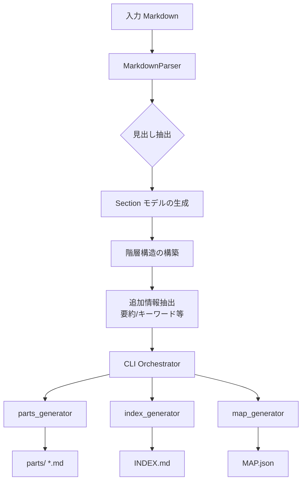

# md2map 解析レポート

## 1. プロジェクトの概要

`md2map` は、大規模なマークダウンファイルを意味的な単位（見出し）ごとに分割し、AIによる解析や人間によるレビューを容易にするためのツール群（INDEX.md, MAP.json, 分割されたファイル群）を生成する Python 製 CLI ツールです。

## 2. アーキテクチャと主要コンポーネント

プログラムはモジュール化されており、以下の主要コンポーネントで構成されています。

### 2.1 データモデル (`md2map/models/`)

- **Section**: セクションの情報を保持するデータクラス。
  - 属性: 見出しテキスト、レベル、行範囲、親セクション、階層パス、要約、キーワード、リンク、ファイルパスなど。

### 2.2 パーサー (`md2map/parsers/`)

- **MarkdownParser**: マークダウンの解析を担います。
  - **ATX見出し抽出**: `#` で始まる見出しを正規表現で抽出。
  - **コードブロック回避**: コードブロック（```）内の見出し様テキストを無視。
  - **メタデータ抽出**: セクション冒頭の要約（summary）、太字部分からのキーワード（keywords）、リンク（links）を抽出。
  - **階層構築**: 見出しレベルに基づき、セクション間の親子関係と階層パスを構築。

### 2.3 ジェネレーター (`md2map/generators/`)

- **parts_generator.py**: セクションごとに独立したファイルを `parts/` ディレクトリに生成。メタデータをHTMLコメントとしてヘッダに埋め込みます。
- **index_generator.py**: `INDEX.md` を生成。全体の構造ツリーと、各セクションの詳細（要約等）を一覧表示。
- **map_generator.py**: `MAP.json` を生成。機械可読な形式で、各セクションのID、行範囲、チェックサム等を提供。

### 2.4 CLI (`md2map/cli.py`)

- `argparse` を使用したコマンドラインインターフェース。
- `build` コマンドを提供し、解析から生成までの一連のフローを制御。
- `dry-run` モードにより、実際にファイルを生成せずに分割計画を確認可能。

## 3. 処理フロー



## 4. 特徴と工夫

- **日本語対応**: 日本語ドキュメントの文字数カウントやパス生成を考慮しています。
- **一意識別子 (ID)**: `MD1`, `MD2` といった短いIDを付与することで、LLM（大規模言語モデル）との対話において特定のセクションを正確に指定しやすくしています。
- **堅牢な解析**: フロントマター、コードブロック、重複する見出し名、スキップされた見出しレベルなど、多様なマークダウンの状態をハンドリングしています。
- **検証済み**: `pytest` による豊富なテストケース（正常系、エッジケース、日本語対応等）が整備されています。
