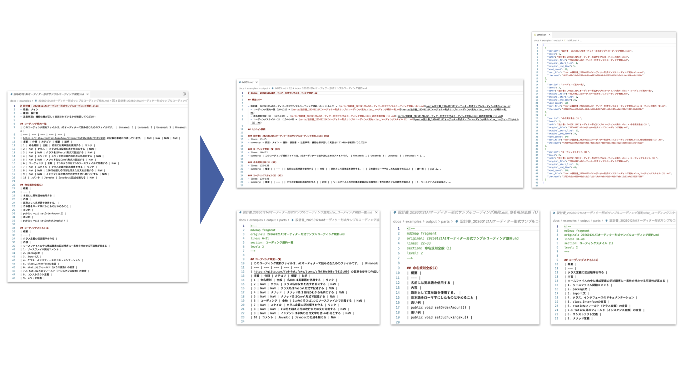

# md2map

[English](./README.md) | [日本語](./README_ja.md)

[](https://elvez.co.jp/)
[](https://elvez.co.jp/ixv/)
[](https://opensource.org/licenses/MIT)
[](https://www.python.org/)
[](https://github.com/elvezjp/md2map/stargazers)

巨大なマークダウンファイルを、AI解析・レビュー向けの「意味的マップ（索引＋分割片）」に変換するCLIツールです。



## ユースケース

- **AIドキュメントレビュー**: 大規模なマークダウンファイルをAIが理解しやすい意味単位に分割し、レビュー精度を向上
- **ドキュメント構造の可視化**: 見出し階層とセクション要約を索引として出力
- **行番号マッピング**: AIの指摘箇所を元ファイルの行番号に確実に対応付け
- **ドキュメント管理**: 大規模な仕様書を管理しやすいパーツに分割して管理

## 開発の背景

本ツールは、日本語の開発文書・仕様書を対象とした開発支援AI **IXV（イクシブ）** の開発過程で生まれた小さな実用品です。

IXVでは、システム開発における日本語の文書について、理解・構造化・活用という課題に取り組んでおり、本リポジトリでは、その一部を切り出して公開しています。

## 特徴

- **見出しベースの分割**: H1、H2、H3（およびそれ以深）の見出しレベルでドキュメントを分割
- **多段階セクション分割**: NLP（形態素解析）やAI（LLM）による意味的な再分割をサポート
- **Markdown索引生成**: 構造ツリーとセクション詳細を含むINDEX.mdを自動生成
- **行番号対応表**: 分割片と元ファイルの対応をMAP.json（機械可読）で提供
- **マルチLLMプロバイダー**: OpenAI、Anthropic、Amazon Bedrockに対応
- **日本語対応**: 日本語ドキュメント処理と文字数カウントを完全サポート
- **コードブロック認識**: コードブロック内の見出しを正しくスキップ
- **ドライラン機能**: 実際の出力前に生成計画を確認可能

## ドキュメント

- [CHANGELOG.md](CHANGELOG.md) - バージョン履歴
- [CONTRIBUTING.md](CONTRIBUTING.md) - コントリビューション方法
- [SECURITY.md](SECURITY.md) - セキュリティポリシー
- [spec.md](spec.md) - 技術仕様書

## セットアップ

### 必要環境

- Python 3.9以上
- [uv](https://docs.astral.sh/uv/)（推奨パッケージマネージャー）

### インストール

```bash
# リポジトリをクローン
git clone https://github.com/elvezjp/md2map.git
cd md2map

# uvで依存関係をインストール（仮想環境も自動作成）
uv sync --all-extras

# 動作確認
uv run md2map --help
```

## 使い方

### 基本的な実行

```bash
# マークダウンファイルを解析（見出しベース分割）
uv run md2map build document.md --out ./output

# カスタム深度で解析（H1-H2のみ）
uv run md2map build document.md --out ./output --max-depth 2
```

### NLPモードで分割

```bash
# 形態素解析による意味的再分割（sudachipy が必要）
uv run md2map build document.md --split-mode nlp

# 再分割の閾値を変更（デフォルト: 500文字）
uv run md2map build document.md --split-mode nlp --split-threshold 300
```

### AIモードで分割

```bash
# LLMによる意味的再分割（Amazon Bedrock、デフォルト）
uv run md2map build document.md --split-mode ai

# OpenAIを使用
uv run md2map build document.md --split-mode ai --ai-provider openai

# Anthropic APIを使用
uv run md2map build document.md --split-mode ai --ai-provider anthropic

# モデルを指定
uv run md2map build document.md --split-mode ai --ai-provider bedrock --ai-model global.anthropic.claude-haiku-4-5-20251001-v1:0
```

### 出力の確認

```bash
# 索引を確認
cat output/INDEX.md

# 分割されたドキュメント片を確認
ls output/parts/

# 行番号対応表を確認
cat output/MAP.json
```

### ドライラン（プレビュー）

```bash
# ファイルを生成せずに計画を確認
uv run md2map build document.md --dry-run
```

## 主要オプション

| オプション | デフォルト | 説明 |
|-----------|-----------|------|
| `--out <DIR>` | `./md2map-out` | 出力ディレクトリ |
| `--max-depth <N>` | `3` | 処理する見出しの最大深度（1-6） |
| `--id-prefix <PREFIX>` | `MD` | セクションIDのプレフィックス（MD1, MD2, ...） |
| `--split-mode <MODE>` / `-m` | `heading` | 分割モード（`heading`/`nlp`/`ai`） |
| `--split-threshold <N>` | `500` | 再分割対象の最小文字数（日本語）/単語数（英語） |
| `--max-subsections <N>` | `5` | 1セクションから生成する仮想見出しの最大数 |
| `--ai-provider <PROVIDER>` | `bedrock` | AIプロバイダー（`openai`/`anthropic`/`bedrock`） |
| `--ai-model <MODEL>` | プロバイダー既定 | AIモデルID |
| `--ai-region <REGION>` | `ap-northeast-1` | Bedrock用リージョン |
| `--verbose` | false | 詳細ログを出力 |
| `--dry-run` | false | ファイル生成せずプレビューのみ |

詳細は `uv run md2map build --help` を参照してください。

## 出力例

### INDEX.md

```markdown
# Index: specification.md

## 構造ツリー

- [MD1] はじめに (L1–L25) → [parts/はじめに.md](parts/はじめに.md)
  - [MD2] 背景 (L3–L10) → [parts/はじめに_背景.md](parts/はじめに_背景.md)
  - [MD3] 目的 (L11–L25) → [parts/はじめに_目的.md](parts/はじめに_目的.md)
- [MD4] 要件 (L26–L50) → [parts/要件.md](parts/要件.md)

## セクション詳細

### [MD1] はじめに (H1)
- lines: L1–L25
- summary: 本ドキュメントはシステム仕様を記述しています...
- keywords: システム, 仕様, 概要
```

### MAP.json

```json
[
  {
    "id": "MD1",
    "section": "はじめに",
    "level": 1,
    "path": "はじめに",
    "original_file": "specification.md",
    "original_start_line": 1,
    "original_end_line": 25,
    "word_count": 150,
    "part_file": "parts/はじめに.md",
    "checksum": "a1b2c3d4..."
  }
]
```

### パートファイル

各パートファイルにはメタデータヘッダが含まれます：

```markdown
<!--
md2map fragment
id: MD1
original: specification.md
lines: 1-25
section: はじめに
level: 1
-->
# はじめに

本ドキュメントはシステム仕様を記述しています...
```

## ディレクトリ構成

```text
md2map/
├── md2map/                # メインパッケージ
│   ├── cli.py             # CLIエントリーポイント
│   ├── generators/        # 出力生成モジュール
│   │   ├── index_generator.py   # INDEX.md生成
│   │   ├── map_generator.py     # MAP.json生成
│   │   └── parts_generator.py   # parts/生成
│   ├── llm/               # LLMプロバイダー（AIモード用）
│   │   ├── base_provider.py     # 基底クラス
│   │   ├── factory.py           # プロバイダーファクトリー
│   │   ├── config.py            # LLM設定
│   │   ├── anthropic_provider.py # Anthropic API
│   │   ├── bedrock_provider.py  # Amazon Bedrock
│   │   └── openai_provider.py   # OpenAI API
│   ├── models/            # データモデル
│   │   └── section.py     # セクション情報クラス
│   ├── parsers/           # ドキュメントパーサー
│   │   ├── base_parser.py       # 基底クラス
│   │   └── markdown_parser.py   # マークダウンパーサー
│   └── utils/             # ユーティリティ
│       ├── file_utils.py  # ファイル操作
│       └── logger.py      # ログ設定
├── add-line-numbers/      # 行番号付与ツール（git subtree）
├── tests/                 # テストコード
│   └── fixtures/          # テストフィクスチャ
├── docs/                  # ドキュメント
├── versions/              # 旧バージョンスナップショット
│   ├── v0.1.0/            # v0.1.0 スナップショット
│   └── README.md          # versionsディレクトリの説明
├── CHANGELOG.md           # 変更履歴
├── CONTRIBUTING.md        # コントリビューションガイド
├── README.md              # 英語版README
├── README_ja.md           # 本ファイル（日本語版）
├── SECURITY.md            # セキュリティポリシー
├── spec.md                # 技術仕様書
└── pyproject.toml         # プロジェクト設定
```

## 制限事項

- **単一ファイル対応**: 現在は1ファイルずつの処理
- **ATX見出しのみ**: Setext形式の見出し（下線）には非対応
- **リンク補正なし**: 内部リンクは検出されますが、パーツ内で自動補正されません

詳細は [spec.md](spec.md) を参照してください。

## 関連プロジェクト

- [add-line-numbers](https://github.com/elvezjp/add-line-numbers) - AIモードで使用する行番号付与ツール
- [code2map](https://github.com/elvezjp/code2map) - ソースコード解析向けの類似ツール

## セキュリティ

セキュリティに関する詳細は [SECURITY.md](SECURITY.md) を参照してください。

- 信頼できないソースからのファイル処理には注意してください
- 出力ファイルには元のドキュメント内容が含まれます

## コントリビューション

コントリビューションを歓迎します。詳細は [CONTRIBUTING.md](CONTRIBUTING.md) を参照してください。

- バグ報告・機能提案: [Issues](https://github.com/elvezjp/md2map/issues)
- プルリクエスト: ブランチ命名規則 `{ユーザー名}/{日付}-{内容}`

## 変更履歴

詳細は [CHANGELOG.md](CHANGELOG.md) を参照してください。

## ライセンス

MIT License - 詳細は [LICENSE](LICENSE) を参照してください。

## 問い合わせ先

- **Issues**: [GitHub Issues](https://github.com/elvezjp/md2map/issues)
- **メール**: info@elvez.co.jp
- **会社**: [株式会社エルブズ](https://elvez.co.jp/)
