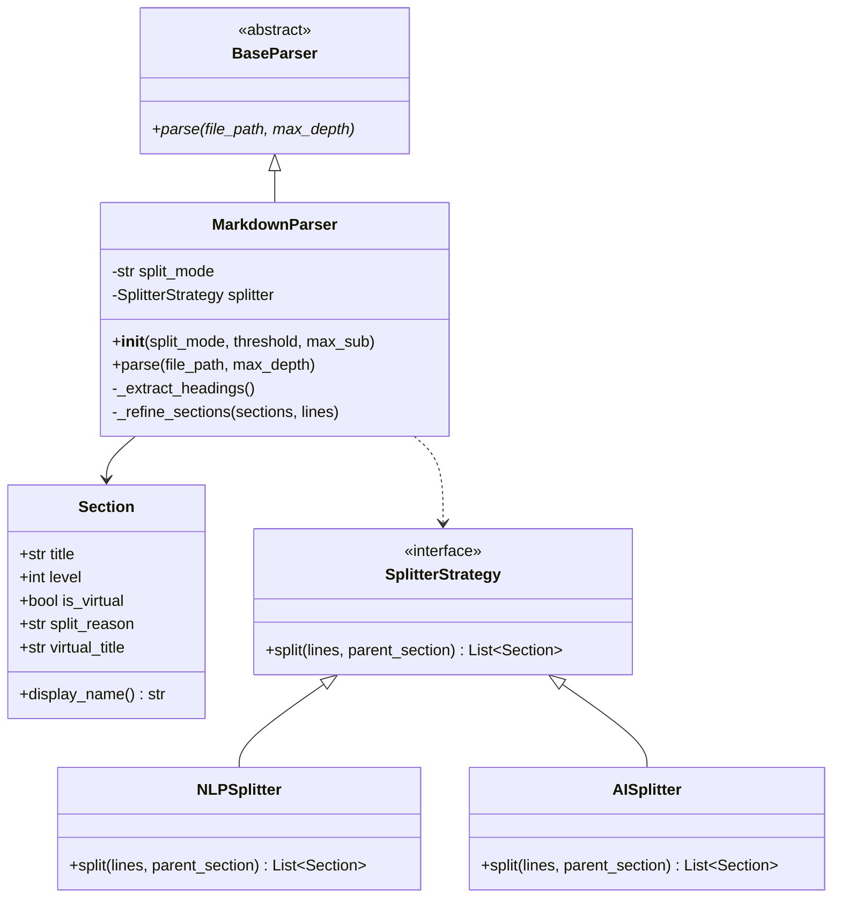

# 機能強化仕様書：ハイブリッド・セマンティック・マッピング

**9292120f78f2757be741635e103dfbdd888f0a08 で対応環境。今後は最新の仕様書、実装を参照してください。**

## 1. 概要

`md2map` の分割ロジックを強化し、見出し記法に依存しない意味的な分割を可能にする。ユーザーは CLI オプションにより、解析方法を柔軟に選択できる。
現状のコードは `MarkdownParser.parse(file_path, max_depth)` を中核にした単一経路であるため、拡張は後段の「リファイン（再分割）」として追加するのが最小変更となる。

### 設計原則

- **後方互換性**: `heading` モード（デフォルト）では既存の動作を一切変更しない。
- **BaseParser インターフェース不変**: `split_mode` は `MarkdownParser` のコンストラクタ引数として渡し、`BaseParser.parse()` のシグネチャは変更しない。
- **依存関係の最小化**: NLP / AI 用ライブラリは optional dependency とし、base パッケージは外部依存なしを維持する。

---

## 2. 追加仕様

### 2.1 セクション分割モードの導入

CLI オプション `--split-mode`（または `-m`）を新設する。
既存の `build` コマンドに追加し、`MarkdownParser` のコンストラクタへ渡す（`BaseParser.parse()` のシグネチャは変更しない）。

| モード (`--split-mode`) | 説明 |
| :--- | :--- |
| `heading` (デフォルト) | 現状の動作。ATX見出しのみで分割。 |
| `nlp` | 形態素解析（Sudachi等）を使用。巨大セクションを統計的に分割。 |
| `ai` | LLM APIを使用。文脈を理解し、仮想的な見出しを動的に生成。 |

### 2.2 データモデルの拡張 (`Section` クラス)

`nlp` および `ai` モードで生成される「仮想的な見出し」を識別するため、以下のプロパティを追加する。
既存の `Section` は出力や ID 生成に広く使われているため、後方互換のデフォルト値を持たせる。

| プロパティ | 型 | 説明 |
| :--- | :--- | :--- |
| `is_virtual` | `bool` | 見出し記法 (`#`) 由来でない場合に `True`。 |
| `split_reason` | `str` | 分割の根拠（例: `"High cohesion boundary"`, `"AI generated topic"`）。 |
| `virtual_title` | `str` | AI 等によって生成された、もとの文書には存在しない見出し名。`is_virtual=True` のとき `title` の表示名として使用する。 |

### 2.3 出力表示の変更

- **INDEX.md**: 仮想見出しには `[Virtual]` などのラベルを付与する。
- **MAP.json**: `is_virtual` および `split_reason` / `virtual_title` を追加。
- **parts/**: 仮想見出しによる分割片にも、適切なメタデータ付きファイルを生成する（ヘッダに `is_virtual` と `split_reason` を追記）。

### 2.4 決定事項（実装ルール）

- **仮想セクションの level**: 親セクションの `level + 1` を基本とする。親が `H6` の場合は `H6` 固定。
- **行範囲の付与**: 分割境界は必ず「行番号」に落とせる単位（段落・空行・見出し境界）で決定する。行番号が確定できない場合は分割しない。
- **表示名の扱い**: `is_virtual=True` のとき `display_name` は `virtual_title` を使用し、`title` は内部名として保持する（元の見出し名が存在しない場合は `title` を空にしてよい）。
- **閾値の持ち方**: 以下の CLI オプションで制御する（後方互換のデフォルト値を設定）。

| オプション | 型 | デフォルト | 説明 |
| :--- | :--- | :--- | :--- |
| `--split-threshold` | `int` | `500` | 再分割対象とする最小文字数（日本語）/ 単語数（英語） |
| `--max-subsections` | `int` | `5` | 1セクションから生成する仮想見出しの最大数 |

- **階層の再構築**: 仮想セクション挿入後、`_build_hierarchy` を再実行して `parent` / `path` を正しく設定する。

---

## 3. 実装計画

### Phase 1: 基盤整備とモデル拡張

- `Section` モデルに新属性を追加（`is_virtual`, `split_reason`, `virtual_title`、すべて後方互換のデフォルト付き）。
- `display_name()` メソッドの更新（`is_virtual=True` のとき `virtual_title` を返す）。
- `--split-mode`, `--split-threshold`, `--max-subsections` オプションの追加。
- `MarkdownParser` のコンストラクタで `split_mode` を受け取り、`parse()` 後段で「Refiner」ステップを実行する（`heading` モードでは何もしない）。
- `SplitterStrategy` インターフェースと、`heading` モード用の NoOp 実装を作成。

### Phase 2: NLP モードの構築 (`Option 1`)

- 依存関係に NLP ライブラリを追加（`janome` または `sudachipy`）。
- 文字数/行数が閾値を超えたセクションに対する「統計的境界検知」アルゴリズムの実装。
- 段落単位での結合度の計算と、転換点への仮想見出し（「(続き)」など）の挿入。

### Phase 3: AI モードの構築 (`Option 2`)

- LLM API（OpenAI等）との連携クライアントの実装。
- 意味的構造化のためのプロンプトエンジニアリング。
- 階層構造を意識したプロンプト（「このセクションを H{n+1} レベルで細分化せよ」）の開発。

### Phase 4: 検証と調整

- 大規模設計書を用いた精度検証。
- 出力物の可読性の微調整。
- 既存テストの回帰確認と、仮想見出しを含む新規テストの追加。

---

## 4. アーキテクチャ設計案



## 5. ユーザー定義・設定

`.env` または設定ファイルにより、AI 連携用の API キーや NLP のパラメータ（分割閾値など）を制御可能にする。

## 6. 依存関係の管理

NLP / AI モードの外部ライブラリは `pyproject.toml` の optional dependency として管理する。base パッケージのゼロ依存を維持する。

```toml
[project.optional-dependencies]
nlp = ["sudachipy>=0.6", "sudachidict-core>=20230927"]
ai  = ["openai>=1.0"]
```

`--split-mode nlp` 指定時に必要なパッケージが未インストールの場合、明確なエラーメッセージとインストール手順を表示して終了する。
